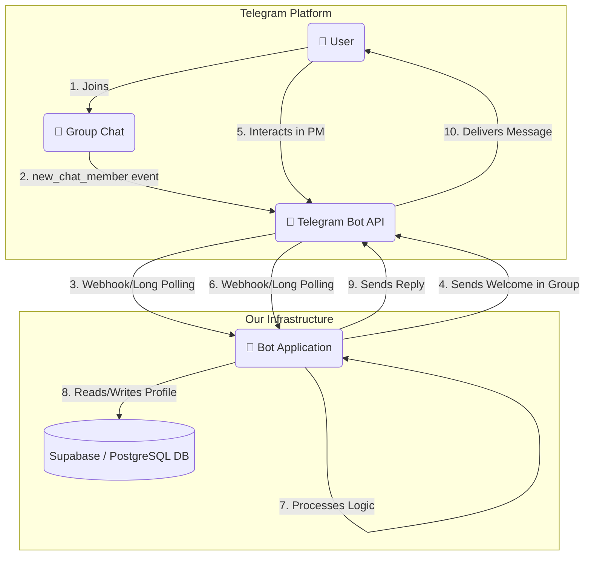

# Architectural Design Document (ADD): Telegram Networking Bot

| **Version** | **Дата**   | **Автор** | **Изменения**                               |
| :---------- | :--------- | :-------- | :------------------------------------------ |
| 1.0         | 22.05.2024 | Anastasia314 | Первоначальная версия документа             |

## 1. Introduction

### 1.1. Purpose
This document provides a comprehensive architectural overview of the Telegram Networking Bot. It details the system components, their interactions, the data model, the technology stack, and deployment strategies. This ADD is a technical guide for the development team, based on the functional and non-functional requirements outlined in the **PRD v1.1**.

### 1.2. Scope
The scope of this architecture is to design a robust, scalable, and maintainable system for the networking bot's core functionality: user onboarding, profile management, and contact matching based on tags.

## 2. Architectural Goals & Constraints

The architecture is designed to meet the following key goals, derived from the PRD's non-functional requirements:

*   **Performance:** The system must respond to user interactions within 2 seconds. This requires an efficient application and an optimized database.
*   **Scalability:** The architecture must handle peak loads, such as the simultaneous onboarding of dozens of users when a conference chat is created. It should be designed to scale horizontally if needed.
*   **Reliability:** The system must maintain a high uptime (99.5%) during events. This implies a stateless application design and a reliable hosting environment.
*   **Maintainability:** The codebase should be modular and well-structured to simplify future updates and bug fixes.
*   **Security:** User data, especially Telegram IDs, must be handled securely. Secrets like API tokens must be stored outside the codebase.

## 3. System Architecture

A C4 model's "Component" level view is appropriate here. The system consists of three main components: The Telegram Bot API, the Bot Application (our backend), and the Database.

### 3.1. High-Level Diagram (Mermaid)



### 3.2. Component Breakdown

1.  **Telegram Bot API:** This is the external interface provided by Telegram. Our application communicates with it exclusively. We will use webhooks for production for instant updates, but long polling can be used for development.

2.  **Bot Application:** This is the core of our system, written in Python. It is a stateless application responsible for all business logic. It can be broken down into several logical modules:
    *   **Webhook/API Handler:** The entry point for all incoming updates from the Telegram API. It receives JSON objects, parses them, and routes them to the appropriate command or state handler.
    *   **State Manager (FSM):** Manages the user's state during multi-step operations, like the profile creation dialogue. For example, it knows if the next message from a user is expected to be their name, company, or tags.
    *   **Command Handlers:** Modules that contain the logic for specific commands (`/start`, `/myprofile`, `/search`).
    *   **Profile Service:** A dedicated module for all CRUD (Create, Read, Update, Delete) operations related to user profiles. It acts as an abstraction layer over the database.
    *   **Matching Service:** Contains the algorithm for matching users. It queries the database for users whose "own tags" match the current user's "search tags".
    *   **Database Client:** Manages the connection to the database and executes queries, likely through an Object-Relational Mapper (ORM).

3.  **Database:** A persistent storage for all user profiles and their associated tags. Given the relational nature of the data (users, tags, and the link between them), a relational database like PostgreSQL is ideal.

## 4. Data Model

To efficiently query tags, we will use a normalized schema with a many-to-many relationship between users and tags. This is far superior to storing tags as a comma-separated string.

### 4.1. ERD (Entity-Relationship Diagram)

```
[Users] --< [User_Tags] >-- [Tags]
```

### 4.2. Table Schema

**Table: `users`**
*Stores the main profile information for each user.*

| Column        | Type          | Constraints              | Description                               |
| :------------ | :------------ | :----------------------- | :---------------------------------------- |
| `telegram_id` | `BIGINT`      | `PRIMARY KEY`, `NOT NULL`| The user's unique Telegram ID.            |
| `name`        | `VARCHAR(255)`|                          | The name the user provides.               |
| `company`     | `VARCHAR(255)`|                          | The user's company.                       |
| `title`       | `VARCHAR(255)`|                          | The user's job title.                     |
| `is_active`   | `BOOLEAN`     | `DEFAULT true`           | For soft deletes. If false, not in search.|
| `created_at`  | `TIMESTAMPTZ` | `DEFAULT now()`          | Timestamp of profile creation.            |
| `updated_at`  | `TIMESTAMPTZ` | `DEFAULT now()`          | Timestamp of last profile update.         |

**Table: `tags`**
*Stores all unique tags to avoid duplication.*

| Column     | Type          | Constraints               | Description                      |
| :--------- | :------------ | :------------------------ | :------------------------------- |
| `id`       | `SERIAL`      | `PRIMARY KEY`             | Auto-incrementing primary key.   |
| `tag_name` | `VARCHAR(100)`| `UNIQUE`, `NOT NULL`      | The text of the tag (e.g., "cpa").|

**Table: `user_tags` (Join Table)**
*Links users to tags and defines the type of association.*

| Column        | Type      | Constraints                                  | Description                                   |
| :------------ | :-------- | :------------------------------------------- | :-------------------------------------------- |
| `user_id`     | `BIGINT`  | `FOREIGN KEY (users.telegram_id)`, `NOT NULL`| References the user.                          |
| `tag_id`      | `INTEGER` | `FOREIGN KEY (tags.id)`, `NOT NULL`          | References the tag.                           |
| `tag_type`    | `VARCHAR(10)` | `CHECK(tag_type IN ('own', 'search'))`   | Defines if it's a self-describing or search tag. |
| **Composite Primary Key on (`user_id`, `tag_id`, `tag_type`)**                                                          |

*This design allows for highly efficient search queries, e.g., finding all users who have an 'own' tag that someone else has as a 'search' tag.*

## 5. Technology Stack

| Component                | Technology Choice             | Justification                                                                                                                                                                                            |
| :----------------------- | :---------------------------- | :------------------------------------------------------------------------------------------------------------------------------------------------------------------------------------------------------- |
| **Language**             | Python 3.10+                  | Specified in the prompt. Excellent ecosystem, fast development, and powerful libraries for bot creation.                                                                                                   |
| **Telegram Bot Framework** | **`aiogram` 3.x**               | A modern, fully asynchronous framework. Its built-in Finite State Machine (FSM) is perfect for creating the multi-step profile creation dialogue. Asynchronous nature is key for performance and scalability. |
| **Database**             | **PostgreSQL (via Supabase)** | PRD mentioned Supabase. Supabase provides a managed PostgreSQL instance, a generous free tier, and easy-to-use APIs, simplifying backend setup. PostgreSQL is powerful and reliably handles relational data.  |
| **Database Client/ORM**  | **`SQLAlchemy 2.0` (Async)** or `asyncpg` | SQLAlchemy provides a powerful ORM to map Python objects to database tables, reducing raw SQL. `asyncpg` is a lower-level, highly performant driver if an ORM is not desired.                     |
| **Deployment / Hosting** | **Railway.app**      | PaaS (Platform as a Service) providers that are extremely developer-friendly. They offer easy Git-based deployment, managed environments, and automatic scaling, aligning with our reliability goal.         |
| **Configuration**        | Environment Variables         | All secrets (Telegram Bot Token, Database URL) will be managed via environment variables (e.g., in a `.env` file for development and platform secrets for production) to ensure security.                    |

## 6. Deployment & Operations

1.  **Environment Setup:**
    *   **Development:** Local machine with Python, a `.env` file for secrets, and long polling for updates from Telegram. The database can be the free tier of Supabase or a local Docker instance of PostgreSQL.
    *   **Production:** A PaaS like Render. The application will be deployed as a web service. Secrets will be configured in the Render environment settings.

2.  **Deployment Process:**
    *   Code will be managed in a Git repository (e.g., GitHub).
    *   Pushing to the `main` branch will trigger an automatic build and deployment on the hosting platform.
    *   The platform will run the bot application using a process manager like `gunicorn` or `uvicorn`.

3.  **Webhook Configuration:**
    *   Once deployed, a one-time setup is required to register the application's URL with the Telegram Bot API using the `setWebhook` method. This tells Telegram where to send updates.

## 7. Security Considerations

*   **API Token Security:** The Telegram Bot Token and Database Connection String will **never** be hardcoded. They will be loaded from environment variables.
*   **Input Sanitization:** While Telegram messages are less prone to injection than web forms, all user-provided text (name, company, etc.) will be treated as plain text and not executed or rendered as HTML without proper escaping.
*   **Rate Limiting:** `aiogram` provides middleware for basic rate limiting to prevent individual users from spamming the bot with commands.
*   **Data Privacy:** Only the data specified in the PRD will be collected. The bot will not have access to messages in the group that are not directed at it (if bot privacy mode is enabled).

---